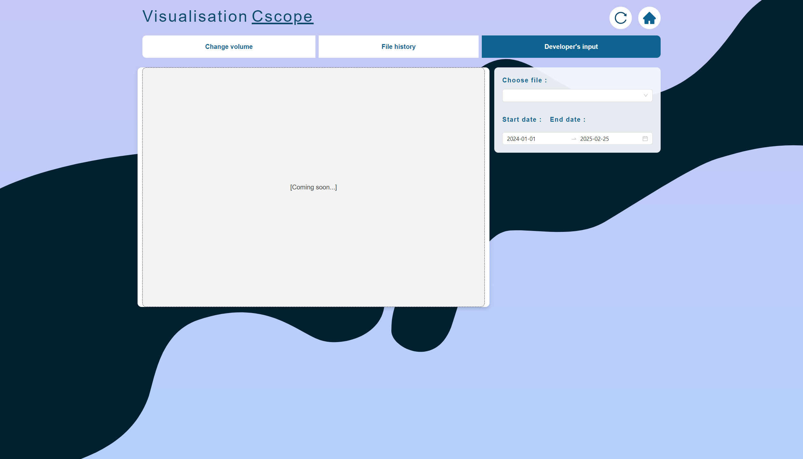

## 4. Exigences
### Récits utilisateurs

### Exigences fonctionnelles
#### Visualisation des commits
|ID|Spécification de l'exigence|
|:-:|:-|
|Cscope-|Afficher un graphique permettant la visualisation des modifications de fichiers dans un répertoire GitHub public.|
|Cscope-|Permettre de filtrer et de trier les commits par date et type de fichier.|
#### Identification des types de modifications
|ID|Spécification de l'exigence|
|:-:|:-|
|Cscope-|Marquer visuellement les ajouts, suppressions et modifications de fichiers.|
|Cscope-|Afficher des résumés des changements pour chaque commit.|
#### Visualisation des types de fichiers modifiés
|ID|Spécification de l'exigence|
|:-:|:-|
|Cscope-|Classer les fichiers modifiés par type (code de production, code de test, configuration, documentation).|
|Cscope-|Fournir des graphiques montrant la répartition des types de fichiers modifiés au fil du temps.|
#### Fréquence des changements et stabilité des fichiers
|ID|Spécification de l'exigence|
|:-:|:-|
|Cscope-|Afficher des graphiques montrant la fréquence des changements de chaque fichier.|
|Cscope-|Identifier les fichiers les plus stables et les plus modifiés.|
#### Changements simultanés de fichiers
|ID|Spécification de l'exigence|
|:-:|:-|
|Cscope-|Visualiser les fichiers modifiés ensemble dans le même commit.|
|Cscope-|Permettre d'identifier les dépendances entre fichiers.|
### Exigences non-fonctionnelles
|ID|Spécification de l'exigence|
|:-:|:-|
|Cscope-|Cscope doit être en mesure de charger un dépôt GitHub.|
|Cscope-|Cscope doit avoir une interface flexible et paramétrable afin que les utilisateurs soient en mesure de choisir les données qu’ils désirent afficher ainsi que leur format.|
|Cscope-|Cscope doit pouvoir afficher les données provenant de GitHub dans un format graphique.|

## 5. Documentation pour l'utilisateur et exigences du système
- **ED-01** : La documentation doit être rédigée en français uniquement.
- **ED-02** : La documentation doit être accessible à partir de GitHub.
- **ED-03** : La documentation doit consister en un ou plusieurs documents à part entière
- **ED-04** : Le répertoire GitHub doit contenir un README.md qui contiendra un guide d’installation
du logiciel, les dépendances et un résumé d’utilisation.

## 6. Contraintes de conception
### Contraintes de programmation
|ID|Spécification de la contrainte|
|:-:|:-|
|CC-|Le back-end logiciel doit être écrit en Ruby, utiliser le cadriciel Ruby on Rails et respecter les normes d’écriture de ce langage.|
|CC-|Le front-end logiciel doit être écrit en React et respecter les normes d’écriture de ce langage.|
|CC-|La base de données utilisée doit être SQLite.|
### Contraintes matérielles
|ID|Spécification de la contrainte|
|:-:|:-|
|||
### Contraintes logicielles
|ID|Spécification de la contrainte|
|:-:|:-|
|CC-|Le service GitHub doit être en ligne pour pouvoir avoir accès aux dépôts.|
|CC-||

## 7. Interfaces
### Interfaces utilisateur
#### Page de base pour entrer l'URL d'un dépôt

#### Page de visualisation de la taille des changements dans le dépôt

#### Page de visualisation de l'historique des modifications sur un ou des fichiers

#### Page du futur Developer's Input

### Interfaces matérielles
-- À faire
### Interfaces logicielles
La communication entre Cscope et GitHub doit se faire via l'API de GitHub.
### Interfaces de communications
-- À faire

## 8. Exigences de licence
Le code source du projet CScope est sous licence MIT. Une traduction de la license est disponible ici: https://www.debian.org/legal/licenses/mit.
Pour plus d'informations, vérifier le fichier *LICENSE.md* du dépôt.

## 9. Remarques légales, de droits d'auteur et diverses
La seule remarque concernant ce projet est que le code source doit être à source ouverte
(open source) pour respecter les requis du PFE.

## 10. Normes applicables
Les normes de nomenclature des langages de programmation utilisés doivent être respectées. Le logiciel doit être fonctionnel sur les systèmes d'exploitation Windows 10 et Windows 11.