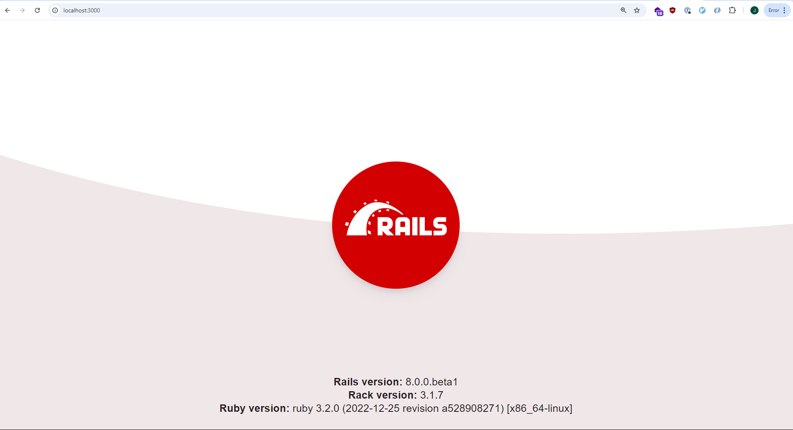

## Development
This is a standard [Rails](https://rubyonrails.org/) application. If you're new to rails, you should read the official [Getting Started with Rails](https://guides.rubyonrails.org/getting_started.html) guide first.

Once you confirmed rails and ruby are installed on your machine, you should be able to run the following:
1. `bin/rails db:prepare`: This will initialize the database
2. `bin/rails server`: This will start the api

You can then visit http://localhost:3000/ and you should see:

This project clones and indexes Git repositories in background jobs. Therefore, you should also launch a job worker as a separate worker using: `bin/jobs`. This process will process jobs enqueued by the api.
